

<H2>天津科讯信息技术有限公司</H2>

# 铁路货车装载状态智能监测系统

## 1. 产品概述

　铁路货车装载状态智能监测系统融合了高清线阵扫描、车号识别、车位检测和机器学习等技术，对运行中列车及货物的装载状态实时监测，生成高清图像并与车号、车速等数据进行匹配，达到还原现场的效果，实现对装载加固、车门窗盖阀、篷布苫盖等八大类问题的快速识别、快速定位、快速标记和实时报警。

- 主要部署点：  
  货检站、货运站、物流基地、专用线、合资铁路、地方铁路、路企交接点、局界口等。  
  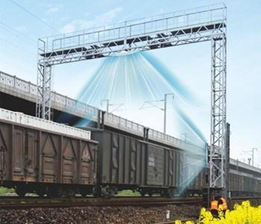

- 应用对象：  
  各级货运及相关管理部门，货运（检）站生产作业及管理岗位。
  
- 据最新《铁路货运检查管理规则》要求对货车进行实时监测，监测方式从人工、面阵摄像机已升级到基于线阵扫描的新型铁路货车装载状态智能监测系统。  
  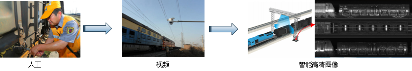

- AI职能检测  
  近年来，随着AI技术发展，已经可以通过人工智能检测各种列车车辆故障，例如如下类似的故障：  
  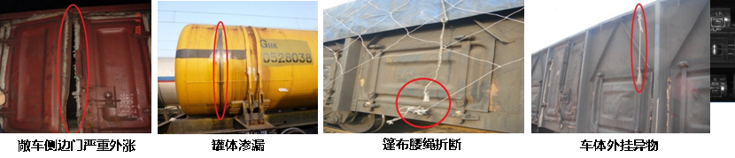

## 2. 产品功能

　产品具有以下功能：

1. 来车自启，检测来车速度及方向；
2. 高清车辆图像采集，一车一图（一般是 3 侧，采集 3 张高清图片）；
3. 车号识别，精确匹配；
4. 自适应补光，保证采集图像的清晰度；
5. AI智能检测，故障实时报警；
6. 生成识别检测报告，可以上传到指定服务器端；
7. 客户端定制化操作，数据浏览方便；
8. 多平台之间数据交互操作；
9. 系统自检，保证系统稳定性。

### 2.1 产品安装位置

- 产品安装图如下：  
  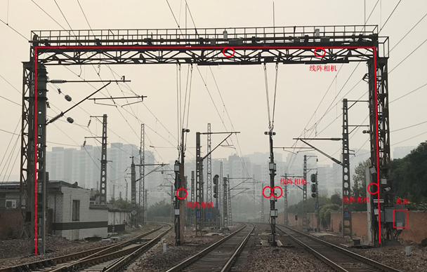

### 2.1 客户端浏览

- 产品浏览方便、快速：  
  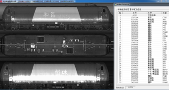

## 3. 产品优势

- 数据融合算法、滤波算法、图像拼接技术  
  可适应低速行驶(0-160km/h)、停车再启动、变速行驶(加减速)和双向行驶列车的数据采集。
- 自适应补光、边缘检测算法  
  图像清晰(8000*2048)，无变形，昼夜无差别，“一车一图”，全方位监控车辆。
- 机器视觉、深度学习  
  AI智能分析、识别装载加固、车门窗盖阀、篷布苫盖等八大货检问题。
- 断点续传技术、数据压缩算法、链路聚合技术  
  数据传输带宽要求低，传输稳定，减少网络传输造成的数据丢失。
- C/S模式、分布式存储、多线程技术  
  数据存储稳定，服务器运行稳定，客户端响应速度快。
- 硬件冗余、模块化设计、定期自动复位  
  系统稳定，维护简单快速，初期投资、及运营成本更低。

## 4. 产品组成

- 产品构成图  
  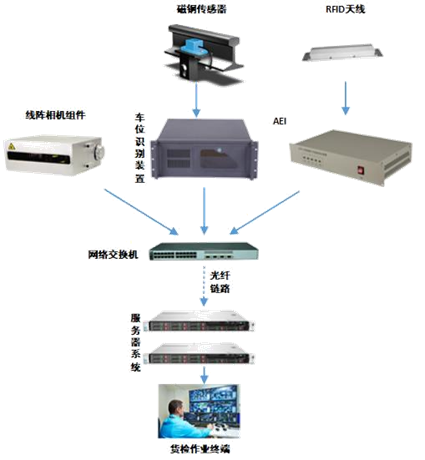

产品系统组成清单：

1. 基础桁架
2. 线阵相机
3. 车号识别装置（含天线）
4. 车位识别设备
5. 磁钢传感器
6. 服务器
7. 网络交换机
8. 光纤通道
9. 作业终端

## 5. 产品参数

- 系统性能参数：  
  适应列车速度：0-160km/h  
  单节车辆图像最低分辨率：8000*2048  
  数据文件存储期限：>3个月  
  车辆成像自动分割准确率：>99.99%  
  系统数据的完整性：≥99.9%  
  识别准确率≥99%  
- 工作条件  
  防护等级：IP65  
  室外设备：温度-40℃～70℃ 湿度≤95%  
  室内设备：温度-10℃～60℃ 湿度≤95%

## 6. 数据展示

- 车辆AI智能识别  
  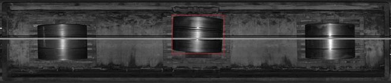  
  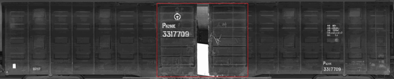  
  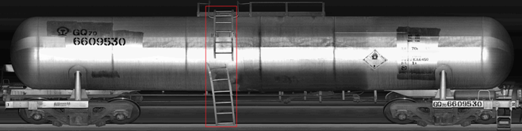

- 运煤车辆AI智能识别  
  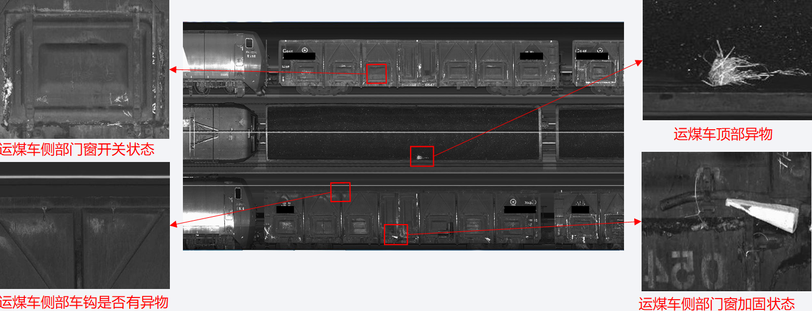

## 7. 产品对比

　在系统稳定性、数据精确性和图像质量等方面，我司系统的性能优于其他品牌的系统，处于国内领先水平！

- 性能和应用对比如下：  
  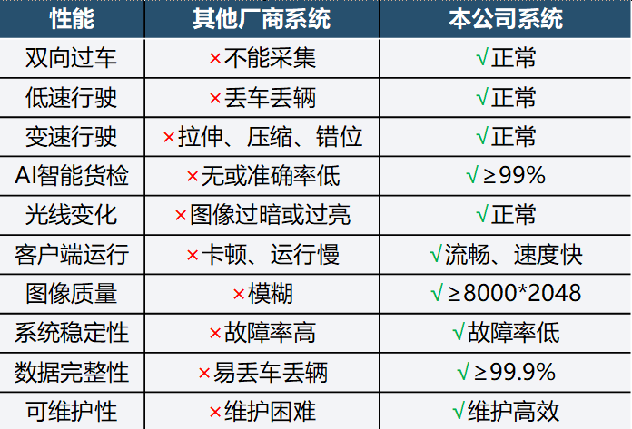

## 8. 产品部署

- 前端设备模块化部署，施工简单、快捷  
  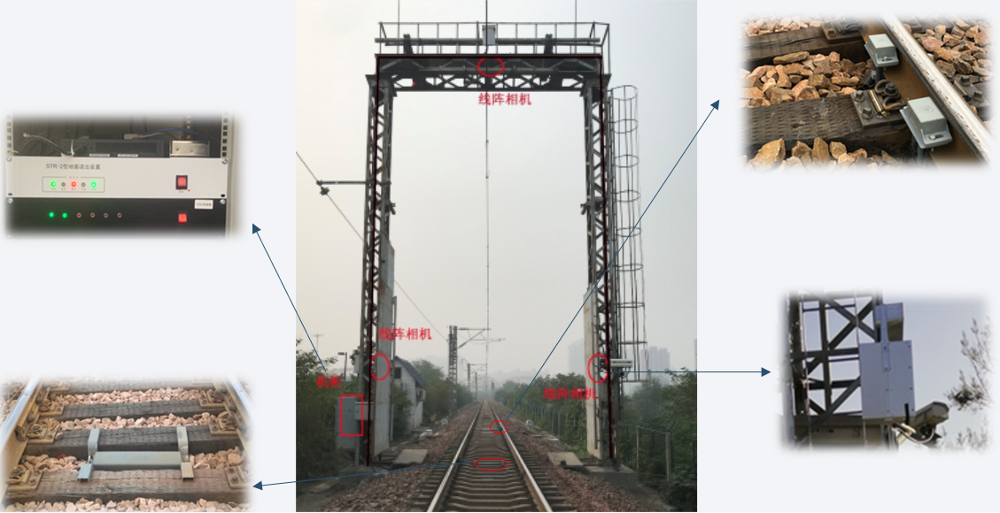

- 机房部署  
  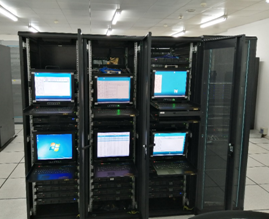

- 货检点部署  
  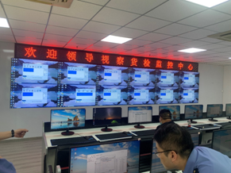

- 货检终端快速、高效  
  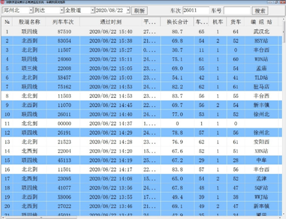

## 9. 产品案例

- 郑州铁路局  
  郑州北站是我国铁路运输的“心脏”，主要担负京广、陇海四个方向货运列车的货运编组任务，日均办理货车超过36000辆，拥有各种线路228条，线路总长454公里。  
  目前在郑州北站5个到达场已投入使用，日均货检作业约15000辆，经过长时间的运行，在系统稳定性、数据精确性和图像质量等方面，得到高度评价！  
  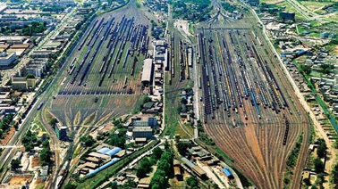
- 南昌铁路局  
  在多个货场的货检系统已上线部署 1 年以上，稳定运行。
- 石家庄敬业集团  
  属于企业专用线，敬业站上线部署 5 套系统。

## 10. 市场展望

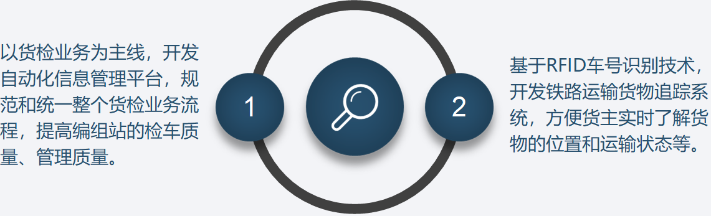
