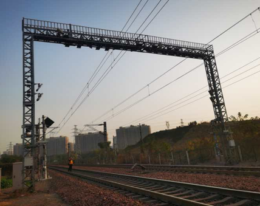
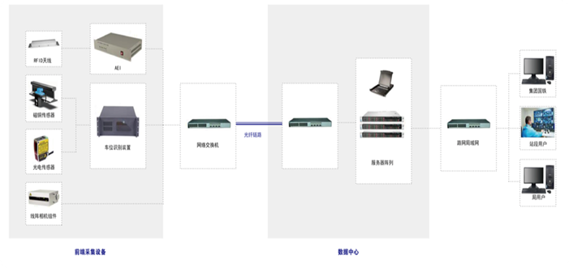
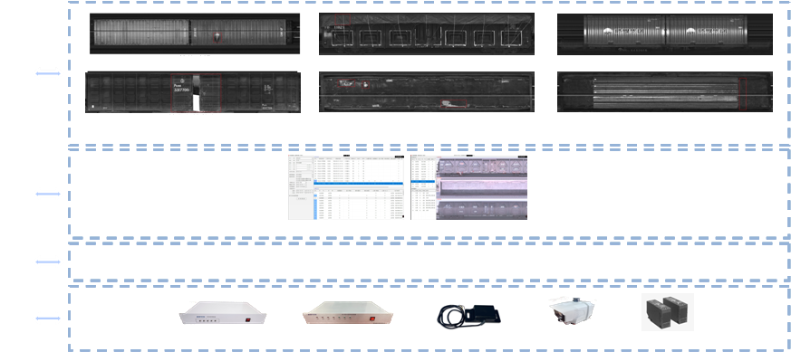
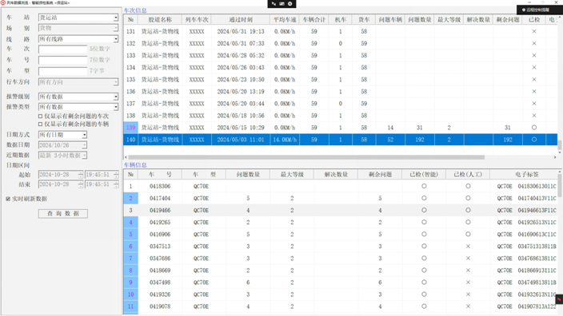
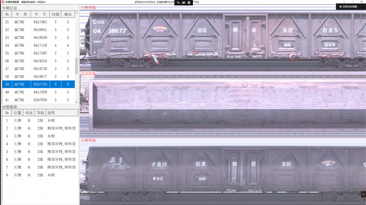
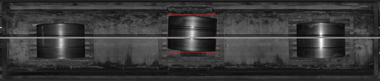
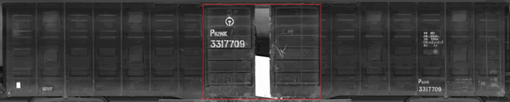
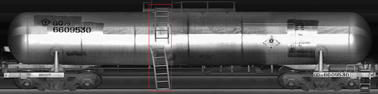
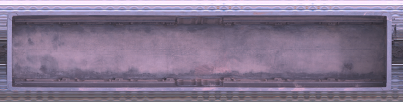
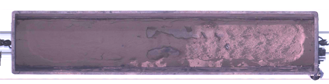

<H3>天津科讯信息技术有限公司</H3>

# 货车交接检查智能监测系统

## 1. 产品简介

系统融合了高清图像采集、车号识别、车位检测和机器学习等技术，对运行中列车及货物的装载状态实时监测，生成高清图像并与车号、车速等数据进行匹配，达到还原现场的效果，实现对装载加固、车门窗盖阀、篷布苫盖等八大类问题的智能识别、快速定位、快速标记和及时报警。

- 系统布置图  
  

- 组网布局  
  

- 系统框架  
  

## 2. 功能特点

### 2.1 功能特点

- 高清图像  
  实时采集和处理列车左、右、顶三侧高清图像。
- 车号识别  
  精确识别车号，并与对应车辆图像进行匹配。
- 数据浏览  
  列车数据总览、车辆数据检索、图像的放大缩小、截取、标记等功能。
- 自适应补光  
  根据光线强弱进行自适应补光，保证图像采集质量。
- 系统自检  
  硬件异常自动报警、软件异常自动复位，保证系统长期稳定运行。

### 2.2 AI智能识别

　系统可以通过人工智能识别如下问题：

1. 装载加固  
   货物或部件发生旋转、开放  
   货物发生移动、滚动、倒塌、倾覆、坠落  
   加固材料及装置发生松动、折断、破损、变形、脱垂
2. 集装箱  
   装载集装箱未落槽  
   集装箱未按规定捆绑加固
3. 篷布苫盖  
   篷布或绳网掀起、脱垂、破损、苫盖不良  
   篷布绳索松脱、绳网松动
4. 治安  
   车上有爬乘和闲杂人员
5. 车辆技术状态  
   车门配件缺失、开焊、变形  
   棚车车门脱落  
   货物撒漏
6. 车门开启  
   车门、销及搭扣未落槽  
   罐车螺栓未拧固  
   车窗开启、盖阀张开
7. 异物和残留物  
   车内杂物  
   车体杂物

## 3. 系统应用展示

### 3.1 客户端界面

- 客户端车次一览界面  
  

- 客户端车辆浏览界面  
  

### 3.2 智能检测效果

- 卷钢位置偏移  
  
- 棚车侧门开启  
  
- 罐车车梯损坏  
  
- 敞车散装货物顶部视图对比  
  空载  
    
  满载  
  

## 4. 降本增效

以本公司投产使用的某火力电厂铁路专用线为例：
1. 减少低效人员投入  
     作业专用线一般在正线安装1套系统，实现到站进车的装载状态监测；在空车线安装1套系统，实现卸车、清底、加固作业后的装载状态监测。从而将检车作业调整到室内完成线上检查工作，同时一个岗位可同时监测多列车，降低作业成本，减少人员劳动强度，保障员工人身安全。
2. 简化作业流程  
    ① 本智能系统应用后，在客户端即可实现检车作业、报告生成、问题车数据截取、一键上传等任务，大大简化了货检作业本身的流程手续，提高了作业效率。  
    ② 根据专用线的业务性质，需要和正线铁路实时进行车辆交接作业任务，本系统前端采集设备分别在各线路部署后，只需对多级用户分别部署作业客户端，即可实现相互之间的货运交接任务，实现线上办公不需人员驻守检查工作，大大简化了货运交接流程。

## 5. 市场规模

- 专用线一般包括：电厂、钢厂、物流公司等企业专用线，能源运输专用线，地方铁路专用线等等。
- 以火力电厂专用线为例：一般电厂有1条到发线，厂区内有2条重车线和2条空车线，根据已有案例分析，一般在1条到发线和2条空车线分别部署1套系统，总共为3套。
- 据相关数据统计，全国大型火力发电厂达3000多家，平均至少需求系统数量为9000套。

　由此可见，全国的专用线市场需求规模非常大，市场前景非常可观！

