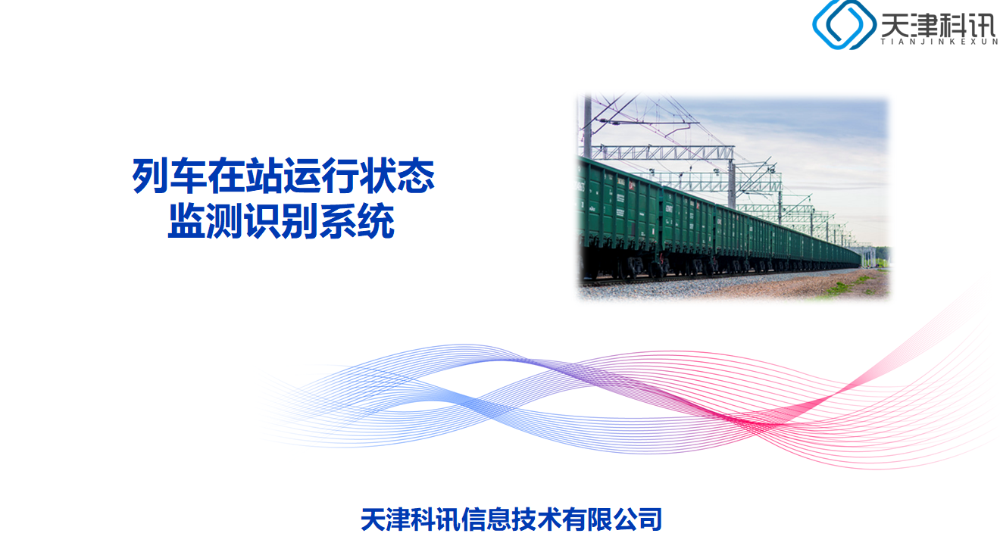
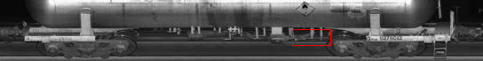

<H3>天津科讯信息技术有限公司</H3>

# 列车在站运行状态监测识别系统

## 1. 行业背景

　为了保证列车运行的安全，列车接入车站和由车站出发，按照一定的程序办理接发列车是必要的作业流程。目前的接发列车工作主要依赖于人工及简单人机结合，依靠助理值班员出场“三面六看”，发现和防止列车在始发、运行中存在的安全隐患。近年来，随着线路扩建，运量跨越式增长，传统的接发车方式已无法满足需求。  

- 传统列车检查示例图：  
    
  

　为此，本公司研发了列车在站运行状态监测识别系统（以下简称“智能接发车系统”），该系统的应用可以提升运输安全管理的效率和信息化水平,极大的提升接发车作业质量，降低铁路行车安全风险，保障铁路安全生产，对铁路接发车作业起到了减员、增效、保安全的效能。

## 2. 方案概述

　我公司的智能接发车系统由高清彩色线阵相机、车号识别、音频采集器等传感器和处理单元组成，将图像智能识别技术、语音识别技术和机器学习算法相结合，对运行列车进行多手段、全空间、跨站段的、跨时域监控，实现运行列车故障的在线预览、实时预警、自动报警功能。

- 系统方案示例图：  
  

智能接发车系统一般部署在普速铁路主要干线和高普共线客运专线的中间站，部署位置为进出站咽喉部位，对列车装载、车体、走行部等影响行车安全问题进行多方位智能监测。

- 设备安装示例图：  
  

## 3. 组网布局

- 系统布局图  
  

## 4. 系统框架

- 系统框架图  
  

## 5. 系统功能

- 系统功能说明图：  
  

## 6. 技术优势

- 技术优势说明图：  
  

## 7. AI识别种类

- 智能识别种类一览：  
  

## 8. 效果展示

### 8.1 智能识别类型图

- 类型1：  
  

- 类型2：  
  

- 类型3：  
  

- 类型4：  
  

### 8.2 客户端效果

- 列车车次一览界面  
  

- 车辆图像浏览界面  
  

